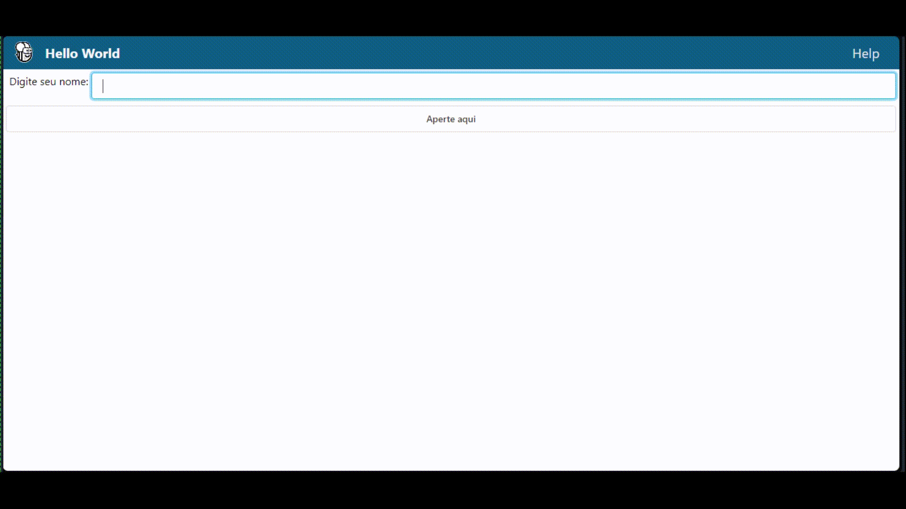
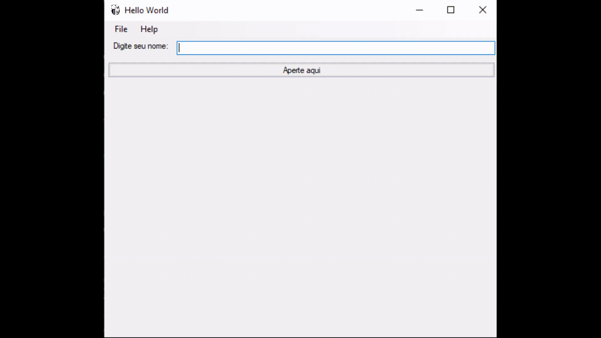

<h1 align="center"> Tutorial BeeWare </h1>

## 💻 Projeto

Este tutorial, é a base para criação de projetos com o framework BeeWare, o projeto é um Hello word, um 1° projeto usando o framework.
  

## 🚀 Tecnologias

Esse projeto foi desenvolvido com as seguintes tecnologia:

## 🔖 Layout Web

 

## 🔖 Layout Desktop

 

